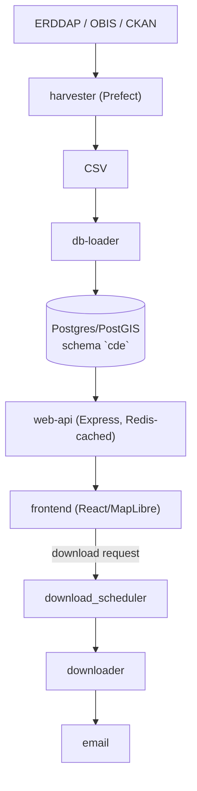

# CLAUDE.md

This file provides guidance to Claude Code (claude.ai/code) when working with code in this repository.

## What this is

CDE (CIOOS Data Explorer): harvests oceanographic dataset metadata from ERDDAP
servers, OBIS and CKAN into PostgreSQL/PostGIS, and serves a map-first
search/download UI over it. One deployable system, six services (plus
`nginx/` as edge proxy and `test/` for integration smoke tests) — see
**Architecture** below for what each does.

## Setup

```sh
cp .env.sample .env
cp docker-compose.override.yaml.sample docker-compose.override.yaml
cp harvest_config.sample.yaml harvest_config.yaml
docker compose up -d --build
```

Docker images bake their own dependencies (no source bind mount), so the stack
above doesn't need a local `uv sync`/`npm ci`. Run `uv sync && npm --prefix
frontend ci && npm --prefix web-api ci` only for: local lint/format hooks
(`.claude/hooks/lint-on-edit.sh`, `uvx pre-commit install`) and local frontend
dev (below).

Python: uv, pinned to 3.10 everywhere (`.python-version`). `uv lock --check`
must pass in `.`, `harvester`, `downloader`, `download_scheduler` — both
Dockerfiles build with `uv sync --locked`, so a stale lock is a broken image.

**Frontend-only** dev setup (pointing at an already-running backend on
another instance/machine) is documented in `frontend/CLAUDE.md`.

## Commands

```sh
uvx ruff check .                    # config: [tool.ruff] in root pyproject.toml, governs all 3 py projects
uv run pytest -m "not integration"  # Python unit tests
npm ci && npm run lint && npm run lint:css && npm run format:check  # root JS/CSS toolchain
npm --prefix web-api test
npm --prefix frontend run build
```

Single-test:

```sh
uv run pytest tests/unit/test_foo.py::test_bar        # from harvester/, downloader/, or download_scheduler/
npm --prefix web-api run test:unit                     # node --test utils/**/*.test.js
npm --prefix web-api run test:routes                   # node --test routes/**/*.test.js
npm --prefix web-api run test:contract                 # jest (supertest)
npx vitest run src/path/to/File.test.jsx                # from frontend/
npm --prefix frontend run test:e2e                     # Playwright, API mocked from e2e/fixtures
npm --prefix frontend run test:visual                  # needs Docker (e2e/in-container.sh)
npm --prefix frontend run test:a11y                    # axe, ratcheting baseline
```

Prettier formats, ESLint/stylelint/ruff lint — one config at repo root each,
covering all sub-projects (ruff walks up to root `pyproject.toml`; eslint/
stylelint at root cover `frontend/`, `web-api/`, `test/`). `uvx pre-commit
install` for the rest (line endings, secrets, lockfile checks).

## Workflow requirements

- **Lint before calling any change done**: a `PostToolUse` hook (`.claude/hooks/lint-on-edit.sh`) already enforces this automatically.
- **New features need tests**: add unit tests (and e2e/integration where warranted) using each sub-project's existing patterns.
- **Flag tests that changes break**: if an edit changes behavior an existing test asserts on, tell the user which test(s) need rewriting instead of silently weakening the assertion.
- **Code is the documentation**: keep comments to the strict minimum (only non-obvious *why*, never *what*); don't add docs/docstrings/READMEs unless requested.

## Architecture



Per-service conventions and gotchas live in that service's own `CLAUDE.md`
(loaded only when working there): `harvester/`, `database/`, `web-api/`,
`frontend/`, `downloader/`, `download_scheduler/`.

## Deployment

- `master`/`development` push → auto-deploy (`.github/workflows/deploy.yml`).
- Coolify (dev/staging): `docker-compose.yaml` alone, no host ports.
- Self-hosted prod: `docker-compose.yaml` + `docker-compose.production.yaml`
  overlay. See root `README.md` for the compose invocation and the
  `Rebuild Database` Prefect deployment (post-schema-change).
