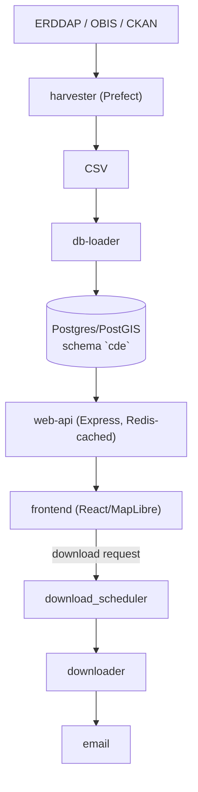

# CDE - CIOOS Exploration and Data Discovery

[](https://github.com/cioos-siooc/explore-cioos/actions/workflows/build_and_test.yml)
[](https://github.com/cioos-siooc/explore-cioos/actions/workflows/deploy.yml)
[](https://github.com/cioos-siooc/explore-cioos/actions/workflows/harvest.yml)

CDE harvests oceanographic dataset metadata from ERDDAP, OBIS and CKAN into
PostgreSQL/PostGIS and serves a map-first search and download UI over it.

## Architecture



`nginx/` is the edge proxy; `test/` holds the integration smoke tests. Each
service has its own README.

## Quick start

Requires [Docker](https://docs.docker.com/get-docker/) with `docker compose`.

```sh
./scripts/init-dev-env.sh   # creates .env, docker-compose.override.yaml, harvest_config.yaml
docker compose up -d --build
```

- Website: <http://localhost:8098>
- Prefect dashboard (harvests, downloads): <http://localhost:4200>

`init-dev-env.sh` copies each `*.sample` template, skipping files that exist
(`--force` overwrites). It seeds `harvest_config.yaml` from the full production
source list; copy `harvest_config.sample.yaml` instead for a small, fast first
harvest. The override file is what publishes nginx and Prefect on the host —
the base `docker-compose.yaml` publishes no ports.

To see how a single dataset is harvested, without the stack:

```sh
cd harvester
uv run python -m cde_harvester --urls https://data.cioospacific.ca/erddap --dataset_ids ECCC_MSC_BUOYS
# output lands in harvester/harvest/
```

## Configuration

Every setting has a working default in `docker-compose.yaml`. Three values
matter:

| Variable      | Default                          | Purpose                                                                                                            |
| ------------- | -------------------------------- | ------------------------------------------------------------------------------------------------------------------ |
| `DB_PASSWORD` | _none — required_                | Compose aborts without it; production publishes the DB port, so a default would be a real credential.              |
| `APP_URL`     | `http://localhost:${NGINX_PORT}` | Public URL for emailed download links and the OpenAPI `servers` entry. Coolify's `SERVICE_URL_NGINX` wins over it. |
| `NGINX_PORT`  | `8098`                           | Host port for nginx (`PREFECT_PORT`, default 4200, for Prefect).                                                   |

The SPA calls `/api` relative to its own host, so changing the URL never needs a
frontend rebuild. `DB_HOST` and `REDIS_HOST` are pinned to the compose service
names; setting them in `.env` does nothing.

## Harvesting

Harvests are Prefect flows run **in-process** by the `prefect_worker` container
on the `cde-process-pool` work pool. On startup the worker registers the pool and
every deployment (full harvest, one per source, vernaculars), so there is no
separate deploy step and no system cron.

When harvests run is set in `.env` (all optional):

- `HARVESTER_CRON` / `VERNACULARS_CRON` — recurring schedules; unset means none.
- `RUN_ON_DEPLOY=true` — one full harvest on every (re)deploy.
- `INCREMENTAL_MODE=true` — full runs only update changed datasets. Single-source
  runs are always incremental so they can't truncate other sources.

To run one by hand, open the Prefect UI, find **cde-harvester-deployment** (or a
per-source deployment) and click **Run → Quick Run**.

More in the [harvester README](harvester/README.md) and the
[DB loader README](harvester/cde_harvester/loading/README.md).

### Harvest configuration

`harvest_config.yaml` is never baked into the image. The worker reads it at
startup and again at the start of every flow run, from the first of:

1. `HARVEST_CONFIG_B64` — the whole YAML, base64 on one line
   (`base64 < harvest_config.yaml | tr -d '\n'`). Use this under Coolify.
2. `HARVEST_CONFIG_FILE` — path to a mounted file
   (`/app/harvester/harvest_config.yaml` in the compose files).
3. A file mounted at `/app/harvester/harvest_config.yaml`.

With none of these — or a value that fails to decode — the worker refuses to
start rather than harvest the wrong thing.

| What changed                                                                | What's needed                                                                                |
| --------------------------------------------------------------------------- | -------------------------------------------------------------------------------------------- |
| Values in the mounted file (`cache`, `incremental`, `dataset_ids`, …)       | Nothing — the next run re-reads it                                                           |
| `erddap_urls`, or `obis_discovery.enabled`                                  | `docker compose restart prefect_worker` (re-registers per-source deployments)                |
| Which OBIS datasets exist                                                   | Nothing — discovery re-queries the OBIS API every run                                        |
| Anything set via env (`HARVEST_CONFIG_B64`, `HARVESTER_CRON`, other `.env`) | `docker compose up -d --force-recreate prefect_worker` — `restart` keeps the old environment |

### Scaling workers

- Same host: `docker compose up -d --scale prefect_worker=N` (registration is
  idempotent).
- Another host: the Prefect API and DB must be reachable, and the `cde-harvester`
  image available there. Remote workers only poll (`REGISTER_DEPLOYMENTS=false`)
  and need the same harvest config as the primary stack:

  ```sh
  PREFECT_API_URL=https://<prefect-host>/api DB_HOST_EXTERNAL=<db-host> \
    docker compose -f docker-compose.worker.yaml up -d
  ```

  CSV output, logs and caches stay local to each host; the DB is the source of
  truth.

The Prefect server keeps its metadata in a dedicated `prefect` Postgres database
in the shared `db` service — SQLite locks under concurrent workers.

### Rebuilding the database after a schema change

Postgres applies `database/1_schema.sql` only on a **fresh** volume, and
`db_migrate` re-applies only the `[3-9]_*.sql` function files. A deploy that adds
or renames a table therefore migrates "cleanly" and then fails at query time with
`relation "cde.<table>" does not exist`.

The `Rebuild Database` deployment fixes this in place. It drops the `cde` schema,
re-applies all SQL in one transaction, flushes the redis tile cache and triggers a
full harvest. **It destroys all harvested data**, so `confirm` must equal
`DB_NAME`; pass `-p run_harvest=false` to leave the database empty.

```sh
docker exec <prefect_worker> sh -c "cd /app/harvester && uv run prefect deployment run \
  'Rebuild Database/cde-rebuild-database' -p confirm=$DB_NAME"
```

Prefer this to deleting the Postgres volume. If you must delete it, it is named
for the compose project (e.g. `explore-cioos-production_postgres-data`) — check
`docker volume ls` first. Redis has no volume; restarting it clears the cache.

## Downloads

The web API queues downloads in `cde.download_jobs`; the `scheduler` service
drains the queue. It is a plain polling worker, deliberately **not** on the
Prefect pool: downloads (OBIS parquet through DuckDB, multi-hundred-MB CSVs) would
compete with harvests for the pool's memory, and a harvester crash can't take the
queue's only consumer down with it.

Each job still shows up in Prefect as a `Download Job` flow run named
`download-<job_id>`, with the scheduler's logs. `failed` jobs are failed runs;
`completed`, `no-data` and `over-limit` are successes, since the user is emailed
about those. This relies on `PREFECT_API_URL`, which compose hardcodes to
`http://prefect:4200/api` on the scheduler (the `.env` value is `localhost`, which
inside a container is the container itself). Without it the queue drains the same;
jobs just don't appear in Prefect.

## Development

### Frontend

**Option 1 — backend in Docker** (full-stack work): start the stack as in
[Quick start](#quick-start), then

```sh
cd frontend && npm install && npm start   # http://localhost:8000
```

The dev server proxies `/api` to `http://localhost:8098`. For a stack on another
port or host, set `DEV_API_PROXY_TARGET=http://localhost:9000`.

**Option 2 — remote API** (frontend-only work):

```sh
cd frontend && npm install && API_URL=https://explore.cioos.ca/api npm start
```

### Running services outside Docker

1. Start only the database and Prefect: `docker compose up -d db prefect`
   (or `uv run prefect server start`).
2. `uv sync` in `harvester/` and `download_scheduler/`.
3. Start the API: `cd web-api && npm install && npm start`.
4. Start the download scheduler: `cd download_scheduler && uv run python -m download_scheduler`.
   Export `PREFECT_API_URL=http://localhost:4200/api` first to see downloads in
   Prefect.
5. Start the frontend as in Option 1.
6. Harvest and load: `uv run --project harvester sh data_loader.sh` from the repo
   root.

### Linting and tests

Docker images bake in their dependencies and source (no bind mount), so rebuild
an image to pick up code changes. Install locally
(`uv sync && npm ci && npm --prefix frontend ci && npm --prefix web-api ci`) only
for lint/format hooks and local frontend dev.

Python uses uv, pinned to 3.10 (`.python-version`). `uv lock --check` must pass in
`.`, `harvester`, `downloader` and `download_scheduler` — the Dockerfiles build
with `uv sync --locked`, so a stale lock is a broken image.

Prettier formats; ESLint, stylelint and ruff lint, each with one config at the
repo root covering every sub-project. `uvx pre-commit install` adds line-ending,
secret and lockfile checks.

```sh
uvx ruff check .
uv run pytest -m "not integration"                     # Python unit tests
npm run lint && npm run lint:css && npm run format:check
npm --prefix web-api test
npm --prefix frontend run build
```

Narrower runs:

```sh
uv run pytest tests/unit/test_foo.py::test_bar        # from harvester/, downloader/, or download_scheduler/
npm --prefix web-api run test:unit                     # node --test utils/**/*.test.js
npm --prefix web-api run test:routes                   # node --test routes/**/*.test.js
npm --prefix web-api run test:contract                 # jest (supertest)
npx vitest run src/path/to/File.test.jsx                # from frontend/
npm --prefix frontend run test:e2e                     # Playwright, API mocked from e2e/fixtures
npm --prefix frontend run test:visual                  # needs Docker (e2e/in-container.sh)
npm --prefix frontend run test:a11y                    # axe, ratcheting baseline
```

## Deployment

### CI/CD

The [Deploy workflow](.github/workflows/deploy.yml) deploys `master` and
`development` once the Integration Tests workflow **succeeds** on that branch, so
a red build never deploys (`workflow_dispatch` allows a manual deploy that skips
the gate). It connects over WireGuard, checks out the tested commit, renders
`.env.production` through 1Password into `.env` on the server, and runs the
production compose pair.

`.env.production` in this repo **is** the production configuration: `op://`
references name 1Password items, everything else ships as written. Change
production settings there, not on the box.

### Coolify (dev/staging)

Create a **Docker Compose** resource pointing at `docker-compose.yaml` alone. It
publishes no host ports and already carries Coolify's magic variables
(`SERVICE_FQDN_NGINX_4000`, `SERVICE_URL_NGINX`, and the same pair for Prefect).
Coolify ignores `docker-compose.override.yaml`.

Paste `.env.coolify.sample` into the resource's environment ("Developer view"):
`DB_PASSWORD` is required; `HARVEST_CONFIG_B64`, `ENVIRONMENT`, `SENTRY_DSN`,
`HARVESTER_CRON`, `INCREMENTAL_MODE` and `RUN_ON_DEPLOY` are optional. **Don't set
`APP_URL` or `API_URL`** — Coolify's `SERVICE_URL_NGINX` provides the public URL.

Relative bind mounts don't work under Coolify, so provide the harvest config
either as `HARVEST_CONFIG_B64` (then **redeploy** — a restart keeps the old
environment; check it with `echo "$HARVEST_CONFIG_B64" | base64 -d`) or as a
Coolify **Persistent Storage file mount** at `/app/harvester/harvest_config.yaml`
if you want it editable in the UI.

### Self-hosted production

`docker-compose.production.yaml` is an **overlay** on `docker-compose.yaml`,
holding only what production adds: host ports (nginx, Prefect, Postgres), the
external `explore-cioos_default` network, the host-editable `harvest_config.yaml`
bind mount, a capped redis config, and an overridable `DB_HOST_EXTERNAL`.
Everything else is inherited.

1. Create the shared network once: `docker network create explore-cioos_default`.
2. Create `.env` — CI does this for you. By hand, start from `.env.production`
   (not `.env.sample`) and replace the `op://` references. Minimum:

   ```sh
   APP_URL=https://explore.example.ca
   DB_PASSWORD=<db superuser password>
   COMPOSE_FILE=docker-compose.yaml:docker-compose.production.yaml
   ```

   `COMPOSE_FILE` makes every `docker compose` command on the box use the pair.
   Production also sets `DB_PORT=5433`, `CORS_ORIGINS`, `ENABLE_API_DOCS=false`,
   Gmail credentials and Sentry. For an external harvester over the VPN, set
   `DB_HOST_EXTERNAL` and `DB_BIND_ADDRESS` to the VPN address; otherwise the DB
   port stays bound to `127.0.0.1`.

3. Copy `harvest_config.sample.yaml` to `harvest_config.yaml` and edit it (see
   [Harvest configuration](#harvest-configuration)).
4. Start: `sudo docker compose up -d --build`.
