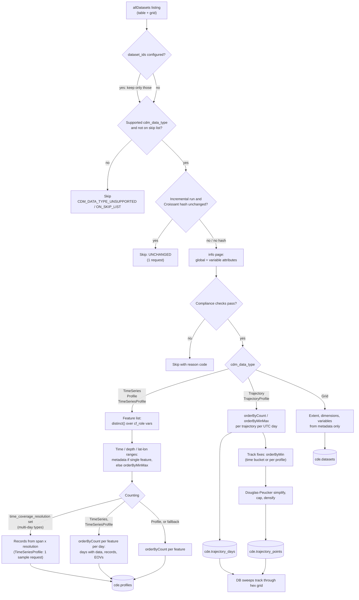

# ERDDAP harvest strategy

> **Harvest docs:** [Workflow](workflow.md)
> · **ERDDAP**
> · [OBIS](obis.md)

How the CIOOS Data Explorer harvester reads each ERDDAP `cdm_data_type`. The
[workflow](workflow.md) page shows where this fits: each ERDDAP server
is its own *Harvest Source* run. The datasets it produces are then given their
catalogue titles and organizations by [CKAN](workflow.md#ckan) and
[loaded](workflow.md#loading) into the database.

The goal for every dataset is to answer **what** (variables and EOVs),
**when** (time coverage and the days with data) and **where** (positions and
depth) from cheap metadata and server-side aggregations, without downloading
full record data and without overloading the source server.

**ERDDAP terms used below.** A *tabledap* dataset is a table of records; a
*griddap* dataset is a gridded array. The `cdm_data_type` attribute says how
the records are organized, and the `cf_role` attribute marks the variable that
identifies each **feature** (a station, a cast, a glider deployment). The
`distinct()`, `orderByCount()`, `orderByMinMax()` and `orderByMin()` filters
make ERDDAP do the work on the server. They return one row per group (a
feature, or a feature and a day) with the distinct values, counts,
minimum/maximum, or first row, instead of the records themselves. Adding
`time/86400` to the grouping groups by UTC day.

Supported types: `TimeSeries`, `Profile`, `TimeSeriesProfile`, `Trajectory`,
`TrajectoryProfile` (tabledap) and `Grid` (griddap). Any other
`cdm_data_type` (e.g. `Point`, `Other`) is skipped with
`CDM_DATA_TYPE_UNSUPPORTED`.

## Every dataset

1. **Listing.** One `allDatasets` request per data structure (`table`,
   `grid`) per server, restricted to public datasets. Its `minTime`/`maxTime`
   are the time coverage stored for tabledap datasets, and the last fallback
   for grids. If the listing fails, the server yields no datasets and the run
   fails without loading (see [Orchestration](workflow.md#orchestration)).
2. **Pre-filters, no request issued.** When the harvest config sets
   `dataset_ids`, every other dataset is dropped without an attempt record
   (on an incremental load they are then [pruned](workflow.md#loading)).
   Then unsupported `cdm_data_type`, and datasets on the
   `skipped_datasets.json` skip list (keyed by server hostname).
3. **Change detection.** The dataset's Croissant document
   (`/{tabledap|griddap}/{id}.croissant`, ERDDAP 2.28+; older servers are not
   asked) is hashed when it lists source files. On an incremental run an
   unchanged hash ends the dataset here: one request, status `UNCHANGED`.
   Database-backed datasets (no file list) are always re-harvested; federated
   datasets are followed to their origin server (up to 3 hops). When no hash
   is produced, the reason (`HASH_NO_FILE_LIST`, `HASH_CROISSANT_HTTP_ERROR`,
   `HASH_CROISSANT_UNREADABLE`, `HASH_CROISSANT_UNSUPPORTED`,
   `HASH_FEDERATED_UNRESOLVED`, or `HASH_CKAN_UNAVAILABLE` after a CKAN
   outage) is stored and shown as the dataset's harvest mode on the dashboard.
4. **Metadata.** The dataset `info` page: global attributes and per-variable
   attributes (`standard_name`, `cf_role`, `actual_range`, units).
5. **Compliance checks** (a failure is a skip, not an error):
   - `cde_ingest=false` global opts the dataset out (`INGEST_FLAG_FALSE`);
   - `time`, `latitude`, `longitude` are required (`Grid`: lat/lon only)
     (`MISSING_REQUIRED_VARS`; also the result of an empty or missing `info`
     page);
   - at least one `standard_name` must map to a GOOS EOV
     (`NO_SUPPORTED_VARIABLES`);
   - not both `depth` and `altitude` (`DEPTH_AND_ALTITUDE`).
6. **Feature extraction** by the type's handler (below). No rows means
   `NO_PROFILES_FOUND`.

Unchanged datasets are not re-harvested. The loader only bumps their
`verified_at` and keeps their stored rows.

Datasets are harvested **one at a time per server**. Responses are streamed
and abandoned past 200 MB (`RESPONSE_TOO_LARGE`). Transient statuses (408,
413, 500, 502, 503, 520, 522, 524) are retried 3 times with backoff; each data
request may take up to 1 hour. A 404 and ERDDAP's "no matching results",
"too much data" and "orderByCount not available" errors are read as an empty
result, which sends the step to its fallback rather than failing the dataset.
A 504 is not retried immediately: ERDDAP keeps computing the query after the
gateway gives up, so the whole dataset is retried once at the end of the
server's pass, at least 20 minutes after the first 504, to pick up the cached
result.

## Point-like tabledap types: `TimeSeries`, `Profile`, `TimeSeriesProfile`

One row per **feature** (a station, a cast, or a station's profile series)
in `cde.profiles`, identified by the dataset's `cf_role` variables
(`timeseries_id`, `profile_id`).

| Step | How | Requests |
| --- | --- | --- |
| Feature list | `distinct()` over the `cf_role` variables. When they are all `subsetVariables`, ERDDAP answers from its subset table, and per-feature lat/lon come along if latitude and longitude are subset variables too. If the `distinct()` is empty (a never-filled `cf_role` column), `orderByMinMax` with `time` instead. | 1–2 |
| Time / depth range | Single-feature dataset: `actual_range`, else `time_coverage_start`/`end` (missing end = ongoing). Otherwise `orderByMinMax("<cf_role vars>,time")`, and the same for `depth`/`altitude`. | 0–2 |
| Position | Single-feature dataset: `actual_range` or `geospatial_*` globals. Subset-table positions when available. Otherwise `orderByMinMax` on latitude and on longitude. | 0–2 |
| Record count, days with data, EOVs | See *Counting* below. | 0–3 |

**Position.** Each feature keeps its lat/lon bounding box for spatial search.
Its map point is the exact position, or the box midpoint when the box
diagonal is at most 1 km. Larger boxes stay searchable, listed and
downloadable, but are kept off the map: they are neither drawn as dots nor
counted in the hex layer (reported as a warning on the harvest dashboard).
Antimeridian-crossing boxes are measured the short way.

**Counting** — the costliest scan, so the cheapest available answer wins:

1. *`time_coverage_resolution` set* (multi-day types only): records =
   timesteps over each feature's span × rows per timestep. No count request.
   For `TimeSeriesProfile`, rows per timestep is sampled with one request at
   the earliest timestep. Days with data fall back to the span; every feature
   gets the dataset's EOVs.
2. *Multi-day types* (`TimeSeries`, `TimeSeriesProfile`): one
   `orderByCount("<cf_role vars>,time/86400")` returns, per feature and UTC
   day, the record count and the non-null count of each EOV-mapped variable.
   This gives the exact set of days with data, the record count, and which
   EOVs each feature actually holds. Skipped when features × span-days
   exceeds 20 M rows; falls through to step 3 when the server refuses the
   interval grouping, the response is empty, oversized or unusable, or no
   feature matched. Features missing from a partial answer use their span.
3. *Otherwise* (`Profile`, or when 2 failed): a plain per-feature
   `orderByCount("<cf_role vars>")`, including the EOV-mapped variables to
   detect per-feature EOVs; on failure it is retried without them and every
   feature gets the dataset's EOVs. A single-feature dataset spanning 30+
   days counts its first 30 days and extrapolates.

A failed step 2 never drops the dataset: when the day set is unknown the
database derives `days` from the time span (an over-count). Step 3 is
required: if it fails, no feature has a record count and the dataset ends as
`NO_PROFILES_FOUND` (or `RESPONSE_TOO_LARGE` when the response passed the
cap).

Features are also dropped when their position, time bounds or depth are
unusable: no lat/lon box or time bounds, latitude outside ±90°, longitude
outside ±180°, depth below 15 000 m or above 100 m altitude.

**Type differences**

- `Profile` — one feature per cast; a cast is a single day, so its span is its
  day set and step 2 is never run.
- `TimeSeries` — one feature per station, spanning many days.
- `TimeSeriesProfile` — a `profile_id` that *is* `time` is dropped before the
  feature list (one "profile" per timestamp would scan the whole dataset).
  Each profile is its own feature, unless any station holds more than 2 000
  profiles: then every station is collapsed to one feature per
  `timeseries_id` with an `n_profiles` count, and its box covers all of its
  profiles' positions.

## Moving platforms: `Trajectory`, `TrajectoryProfile`

Gliders, drifters, ships underway. Position changes every record, so there is
no per-feature point. Two outputs, both reduced on the ERDDAP server so the
response scales with trajectory-days, not with the full-resolution track:

- **Per-day stats** (`cde.trajectory_days`): one row per (trajectory, UTC
  day) with the record count (`orderByCount("<trajectory_id>,time/86400")`)
  and depth range (`orderByMinMax(...,depth)`; skipped when `depth`'s
  `actual_range` is constant). `TrajectoryProfile` also counts distinct
  profiles per day with `orderByMin("<trajectory_id>,<profile_id>,time")`,
  whose result is reused for the track.
- **Track points** (`cde.trajectory_points`): ordered, downsampled fixes.
  - `Trajectory`: one `orderByMin("<trajectory_id>,time/<interval>,time")`,
    the interval sized from the active trajectory-day count so the response
    stays near 300 k candidate fixes (10 min to 1 day). On an HTTP error a
    sub-daily query is retried at a 1-day interval.
  - `TrajectoryProfile`: one fix per profile (its first sample), from the
    per-day profile query above.
  - `Trajectory` tracks are then simplified locally (Douglas-Peucker, 0.5 km
    tolerance), capped at 50 fixes per active day (1 000–60 000; an even
    stride applies if simplifying is not enough), and densified so no
    retained segment exceeds 25 km. `TrajectoryProfile` tracks are only
    simplified when they exceed the cap.
  - Invalid fixes (e.g. Argo 99.999 fill values) and duplicate
    (trajectory, time) rows are dropped.

The database sweeps the track segments through the hex grid to build the map
coverage and apportions the per-day stats across the hexes each day's track
crossed, by time spent in each. A segment is treated as a data gap, and
dropped from both the drawn line and the sweep, when it crosses more than
180° of longitude, when its time gap exceeds both 48 h and 4× the
trajectory's median fix interval, or when it is longer than 50 km with less
than 96 h between fixes. A dataset without a `cf_role=trajectory_id` is
treated as one trajectory.

**Fallback** for servers without `orderBy` interval grouping, or when the
server-side query returns nothing: only the id/lat/lon/time(/depth) columns
are downloaded in monthly chunks (from `time_coverage_start`/`end`; one
request when those are missing) and reduced locally, with the track taken as
the first fix per 30 minutes. A chunk that fails with an HTTP error is
skipped; a chunk past the 200 MB cap fails the per-day stats
(`RESPONSE_TOO_LARGE`).

The track is best-effort: a failed or oversized track extraction never fails
a dataset whose per-day stats succeeded, and the loader then keeps the
dataset's previously stored track.

## `Grid` (griddap)

Metadata only — no data request and no per-feature rows. From the `info`
page:

- **Where:** lat/lon from `actual_range` or `geospatial_*` globals.
  0–360° longitudes are wrapped to −180–180 (a span of 360° or more becomes
  −180–180); a min > max result marks an antimeridian crossing. Depth from
  `geospatial_vertical_*`, else the depth/altitude dimension.
- **When:** the `time` dimension's range, else `time_coverage_start`/`end`,
  else the listing's `minTime`/`maxTime`. Static grids without a time axis
  are accepted.
- **What:** each dimension (size, range, spacing, units) and each data
  variable (with its EOVs), stored on `cde.datasets` and used for the WMS
  overlay.

A grid with no usable lat/lon extent is skipped as `NO_PROFILES_FOUND`.

## In the database

| Harvest output | Table | What the loader adds |
| --- | --- | --- |
| Dataset row (all types) | `cde.datasets` | CKAN title, organizations and link ([CKAN](workflow.md#ckan)); merged day ranges |
| Point-like features | `cde.profiles` | Map point in `cde.points`, hex membership for the map layer |
| Trajectory day stats and track | `cde.trajectory_days`, `cde.trajectory_points` | Track summary, then the hex sweep into `cde.trajectory_hexes` |
| Grid | `cde.datasets` only | — |

Each server run replaces the rows of the datasets it harvested (track points
only when new ones were shipped). It also prunes datasets of that server that
are no longer listed upstream (see [Loading](workflow.md#loading)).

## Reason codes

| Code | Status | Meaning |
| --- | --- | --- |
| `UNCHANGED` | skipped | Croissant hash unchanged; stored rows kept |
| `CDM_DATA_TYPE_UNSUPPORTED` | skipped | `cdm_data_type` is not one of the supported types |
| `ON_SKIP_LIST` | skipped | Listed in `skipped_datasets.json` |
| `INGEST_FLAG_FALSE` | skipped | `cde_ingest=false` global attribute |
| `MISSING_REQUIRED_VARS` | skipped | No `time` / `latitude` / `longitude` (or no readable `info` page) |
| `NO_SUPPORTED_VARIABLES` | skipped | No `standard_name` maps to an EOV |
| `DEPTH_AND_ALTITUDE` | skipped | Both `depth` and `altitude` present |
| `NO_PROFILES_FOUND` | skipped | Feature extraction returned nothing, including a failed record count (or a grid without lat/lon extent) |
| `HTTP_ERROR` | error | ERDDAP answered an error status after retries (other than those read as an empty result); the message holds ERDDAP's own error text |
| `RESPONSE_TOO_LARGE` | error | A required response passed the 200 MB cap |
| `UNKNOWN_ERROR` | error | Any other exception |
| `LOAD_FAILED` | error | Harvested, but the run's database load failed; stored rows kept from the last run |

On an incremental load, a dataset that errors or is skipped keeps the rows
loaded by an earlier run. That includes compliance skips such as
`INGEST_FLAG_FALSE`. The one exception is `NO_PROFILES_FOUND`: the dataset is
removed, because the server was reached and it has nothing to show.
