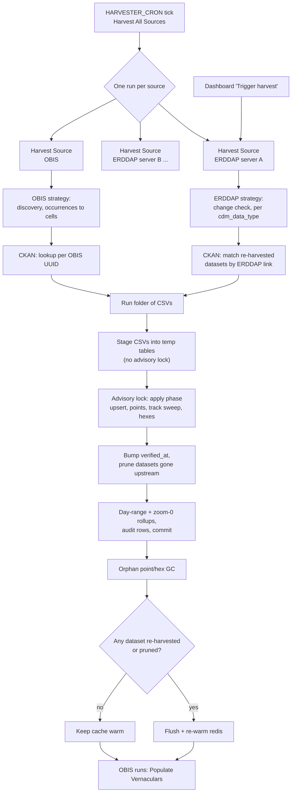

# Harvest workflow

> **Harvest docs:** **Workflow**
> · [ERDDAP](erddap.md)
> · [OBIS](obis.md)

This page describes how the CIOOS Data Explorer harvester turns three upstream
systems into the `cde` database: how runs are scheduled, what each source
contributes, how CKAN enriches the result, and how a run is loaded. How each
source reads its own datasets is described on the
[ERDDAP](erddap.md) and [OBIS](obis.md)
strategy pages.

The goal is the same for every dataset: answer **what** (variables, EOVs,
species), **when** (time coverage and the days with data) and **where**
(positions, depth). The harvester gets these answers from metadata and
aggregations, without storing full record data and without overloading the
source servers or the local database.

| Source | Role | Unit stored | Details |
| --- | --- | --- | --- |
| **ERDDAP** | Primary data source, one server per regional association | One row per **feature** (station, cast), trajectory track, or grid extent | [ERDDAP strategy](erddap.md) |
| **OBIS** | Biological occurrences | One row per ~5 nmi **cell**, with its species | [OBIS strategy](obis.md) |
| **CKAN** | Metadata enrichment only | Title (EN/FR), organizations, catalogue link; EOVs for OBIS | [CKAN](#ckan) below |

## Orchestration

All runs are Prefect flows executed by the `prefect_worker` process pool.

- **Harvest All Sources** (`cde-harvest-all`) is the only scheduled harvest
  (`HARVESTER_CRON`; also run by `RUN_ON_DEPLOY` and by Rebuild Database). It
  triggers one **Harvest Source** run per configured source (each ERDDAP URL,
  plus `obis` when OBIS is enabled) and waits for all of them. One failing
  source does not cancel the others. The orchestrator ends red if any source
  did not complete.
- **Harvest Source** (`cde-harvester-<host-slug>` / `cde-harvester-obis`) is
  one source end to end: harvest, enrich, write CSVs, load into the database,
  and refresh the cache. The dashboard's *Trigger harvest* button starts this
  deployment directly. Single-source runs always load **incrementally**,
  because a full reload would wipe every other source.
- **All sources in one run** (`cde-harvester-deployment`, on demand) harvests
  every source in a single flow and loads them together. It is the only path
  where `incremental: false` performs a [full reload](#loading).
- Sources are submitted together, but the worker runs at most
  `HARVEST_WORKER_LIMIT` flows at once (default 2, and the waiting
  orchestrator holds one slot), so with the defaults sources run one after
  another. Inside a source, datasets are harvested one at a time, to stay
  gentle on the upstream server and bound memory.
- Each run writes its CSVs to `{folder}/{source-slug}/{timestamp}`. After a
  successful load the last 5 runs per source are kept (folders touched in the
  last 6 hours are never removed), so a failed load can be inspected.
- A run that harvested and verified nothing (every dataset errored or was
  skipped, or the server listing failed) fails before loading: nothing is
  loaded or pruned, but the run and its attempts are still recorded.
- **Populate Vernaculars** looks up WoRMS common names for the taxa found in
  OBIS cells. It runs after every load that covers OBIS, and on
  `VERNACULARS_CRON` when set. **Rebuild Database** (on demand, `confirm` must
  equal the database name) drops and recreates the schema, flushes redis,
  then triggers Harvest All Sources.

## Run outcome per dataset

Every dataset a run looks at gets one **attempt** record, which the harvest
dashboard shows per run, server and dataset. A successful run writes them
with its load. A run whose harvest or load fails is still recorded, as a
`failed` run with its error, in its own transaction, so the dashboard shows
the recent failures alongside the last successful run. When the load is what
failed, the datasets the run harvested were not stored, so they are reported
as `error` / `LOAD_FAILED` rather than `success`. A failure after the load
committed (e.g. post-commit cleanup) only marks the run `failed`.

| Status | Meaning | Effect on stored data (incremental load) |
| --- | --- | --- |
| `success` | Harvested; its rows are replaced | Replaced |
| `skipped` | Not harvested, for a reason code: unchanged, out of scope, failed compliance | Kept from the last run (`UNCHANGED` only bumps `verified_at`); `NO_PROFILES_FOUND` removes the dataset |
| `error` | Harvest failed (HTTP error, oversized response, exception), or `LOAD_FAILED`: harvested but the run's database load failed | Kept from the last run |

A full reload truncates everything first, so only `success` datasets remain
after it.

The reason codes are listed on the [ERDDAP](erddap.md#reason-codes)
and [OBIS](obis.md#reason-codes) pages. Each attempt also
records the query URLs used. Errors are grouped per server and distinct error
before being sent to Sentry, so only a new problem raises an alert.

## Change detection and freshness

| | ERDDAP | OBIS |
| --- | --- | --- |
| Change signal | Croissant document hash (ERDDAP 2.28+, file-backed datasets) | None |
| Unchanged dataset | Skipped after 1 request, rows kept | Re-harvested every run |
| Upstream data cache | None; every harvest queries the server | `obis_cache` volume, **no expiry**: new records for an already-cached dataset are not picked up until its cache is deleted |
| New or removed datasets | From the server's `allDatasets` listing | From [discovery](obis.md#choosing-datasets) |
| CKAN metadata refresh | Only for re-harvested datasets: an `UNCHANGED` dataset keeps its stored CKAN title and organizations | Cached per UUID with no expiry, "not found" included |

## CKAN

CKAN is enrichment only. A CKAN outage never fails a harvest. ERDDAP and OBIS
use different CKAN instances: ERDDAP datasets are matched against the CIOOS
national catalogue (`catalogue.cioos.ca`), OBIS datasets against the OGSL
pre-production CKAN's OBIS XML harvest source.

**ERDDAP datasets.** After a server is harvested, and only when at least one
of its datasets was re-harvested, one paged `package_search`
(`res_url:*erddap*`) fetches every catalogue record that has an ERDDAP
resource link. Each link is split into server and `dataset_id` and joined to
the re-harvested datasets. The join is scheme- and case-insensitive. When
several records cite the same dataset, a record linking the whole dataset
wins over one linking a query-string subset (e.g. a single cruise). The CKAN
title (EN/FR) and organizations replace ERDDAP's. When a dataset has no CKAN
record, its ERDDAP title and organizations are used.

If CKAN is unreachable, the datasets keep the CKAN metadata stored by the
previous harvest. Datasets that have nothing stored are loaded without
enrichment, and their change hash is cleared so the next run re-harvests them
instead of skipping them as unchanged.

**OBIS datasets.** Each OBIS UUID is looked up individually through the OBIS
XML harvest source (`xml_location_url`). A match supplies the **EOVs** (OBIS
has none of its own), the French title, the CKAN title and the catalogue
link. Lookups are cached on disk, including "not found" results. A failed
lookup falls back to the stored metadata and is never cached as "not found".

The database then normalizes organization names into `cde.organizations`.

## Loading

A run's CSVs (`datasets`, `profiles`, `obis_cells`, `trajectory_days`,
`trajectory_points`, `skipped`, `verified`, plus the run and attempt audit
files) are loaded into PostgreSQL by `cde_harvester.loading`.

- **Incremental** (every scheduled and single-source run): the CSVs are staged
  into session temp tables and committed without the advisory lock, so
  concurrent sources upload in parallel. The Postgres advisory lock is then
  taken and held until the final commit, so loads serialize on the apply
  phase, pruning and rollups. `process_incremental_update()`:
  1. upserts datasets and replaces only the harvested datasets' profiles,
     cells and trajectory days (track points only for datasets that shipped
     new ones, so a failed track query keeps the old track);
  2. upserts the skip records and normalizes organizations;
  3. adds the new map points;
  4. runs the OBIS steps, only when OBIS data changed;
  5. refreshes the track stats and sweeps the trajectory datasets in this
     load through the hex grid;
  6. builds the hexes and validates the loaded data.

  Unchanged datasets then get their `verified_at` bumped, and stale datasets
  are pruned.
- **Pruning** (incremental only; `CDE_PRUNE_STALE=0` turns it off): a harvest
  lists every dataset of the sources it covers, as changed, unchanged or
  skipped. A dataset of a covered source that appears in none of those lists
  is gone upstream, so its rows are deleted. A skipped or errored dataset
  keeps its previous data. The one exception is a `NO_PROFILES_FOUND` skip:
  that dataset is pruned, but its skip reason stays on record. Sources absent
  from the run are never touched. A per-source guard skips pruning for a
  source (with a warning) when it would remove more than 50% of it in one
  run. A `dataset_ids` restriction in the harvest config leaves the other
  datasets of that server out of every list, so they are pruned unless the
  guard trips.
- **Full reload** (`incremental: false`, only on the all-sources deployment)
  truncates and rebuilds everything under the lock, so the site has no data
  until it commits. It refuses to run when the database holds any source the
  harvest does not cover, unless `CDE_ALLOW_FULL_RELOAD=1` is set, and always
  refuses an empty harvest.
- Both paths finish by refreshing the per-dataset merged day ranges and the
  coarse hex rollup, and by appending the harvest audit rows, then commit.
  After the commit, points, hexes and organizations no longer referenced are
  garbage-collected (skipped when another load holds the lock).

With `flush_redis` on, the redis tile/API cache is flushed and its top
requests re-warmed when the load re-harvested or pruned at least one dataset
(or was a full reload). A run where every dataset was unchanged keeps the
cache warm. OBIS has no change signal, so every OBIS run flushes.
