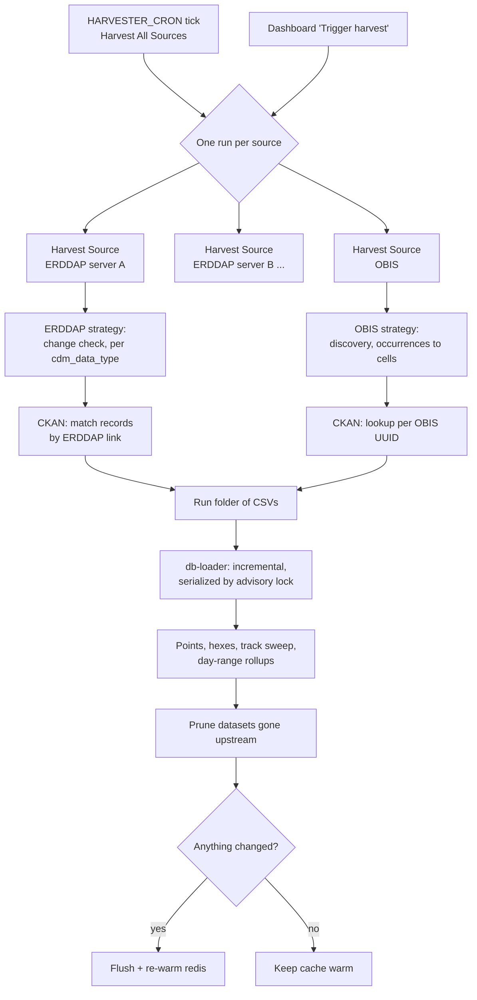

# Harvest workflow

> **Harvest docs:** **Workflow**
> · [ERDDAP](erddap.md)
> · [OBIS](obis.md)

This page describes how the CIOOS Data Explorer harvester turns three upstream
systems into the `cde` database: how runs are scheduled, what each source
contributes, how CKAN enriches the result, and how a run is loaded. How each
source reads its own datasets is described on the
[ERDDAP](erddap.md) and [OBIS](obis.md)
strategy pages.

The goal is the same for every dataset: answer **what** (variables, EOVs,
species), **when** (time coverage and the days with data) and **where**
(positions, depth). The harvester gets these answers from metadata and
aggregations, without storing full record data and without overloading the
source servers or the local database.

| Source | Role | Unit stored | Details |
| --- | --- | --- | --- |
| **ERDDAP** | Primary data source, one server per regional association | One row per **feature** (station, cast), trajectory track, or grid extent | [ERDDAP strategy](erddap.md) |
| **OBIS** | Biological occurrences | One row per ~5 nmi **cell**, with its species | [OBIS strategy](obis.md) |
| **CKAN** (CIOOS national catalogue) | Metadata enrichment only | Title (EN/FR), organizations, catalogue link; EOVs for OBIS | [CKAN](#ckan) below |

## Orchestration

All runs are Prefect flows executed by the `prefect_worker` process pool.

- **Harvest All Sources** (`cde-harvest-all`) is the only scheduled harvest
  (`HARVESTER_CRON`). It triggers one **Harvest Source** run per configured
  source (each ERDDAP URL, plus `obis` when OBIS is enabled) and waits for all
  of them. One failing source does not cancel the others. The orchestrator
  ends red if any source did not complete.
- **Harvest Source** (`cde-harvester-<host-slug>` / `cde-harvester-obis`) is
  one source end to end: harvest, enrich, write CSVs, load into the database,
  and refresh the cache. The dashboard's *Trigger harvest* button starts the
  same deployment. Single-source runs always load **incrementally**, because a
  full reload would wipe every other source.
- Sources run in parallel. Inside a source, datasets are harvested one at a
  time, to stay gentle on the upstream server and bound memory.
- Each run writes its CSVs to `{folder}/{source-slug}/{timestamp}`. The last 5
  runs per source are kept, so a failed load can be inspected.
- **Populate Vernaculars** (own schedule) looks up WoRMS common names for the
  taxa found in OBIS cells. **Rebuild Database** (on demand, confirmation
  required) drops and recreates the schema, then triggers a full harvest.

## Run outcome per dataset

Every dataset a run looks at gets one **attempt** record, which the harvest
dashboard shows per run, server and dataset:

| Status | Meaning | Effect on stored data |
| --- | --- | --- |
| `success` | Harvested; its rows are replaced | Replaced |
| `skipped` | Not harvested, for a reason code: unchanged, out of scope, failed compliance | Kept from the last run (`UNCHANGED` only bumps `verified_at`); `NO_PROFILES_FOUND` removes the dataset |
| `error` | Harvest failed (HTTP error, oversized response, exception) | Kept from the last run |

The reason codes are listed on the [ERDDAP](erddap.md#reason-codes)
and [OBIS](obis.md#reason-codes) pages. Each attempt also
records the query URLs used. Errors are grouped per server and distinct error
before being sent to Sentry, so only a new problem raises an alert.

## Change detection and freshness

| | ERDDAP | OBIS |
| --- | --- | --- |
| Change signal | Croissant file-list hash (ERDDAP 2.28+, file-backed datasets) | None |
| Unchanged dataset | Skipped after 1 request, rows kept | Re-harvested every run |
| Upstream data cache | None; every harvest queries the server | `obis_cache` volume, **no expiry**: new records for an already-cached dataset are not picked up until its cache is deleted |
| New or removed datasets | From the server's `allDatasets` listing | From [discovery](obis.md#choosing-datasets) |

## CKAN

CKAN is enrichment only. A CKAN outage never fails a harvest.

**ERDDAP datasets.** After a server is harvested, one paged `package_search`
(`res_url:*erddap*`) fetches every national-catalogue record that has an
ERDDAP resource link. Each link is split into server and `dataset_id` and
joined to the harvested datasets. The join is scheme- and case-insensitive.
When several records cite the same dataset, a record linking the whole dataset
wins over one linking a query-string subset (e.g. a single cruise). The CKAN
title (EN/FR) and organizations replace ERDDAP's. When a dataset has no CKAN
record, its ERDDAP title and organizations are used.

If CKAN is unreachable, the datasets keep the CKAN metadata stored by the
previous harvest. Datasets that have nothing stored are loaded without
enrichment, and their change hash is cleared so the next run re-harvests them
instead of skipping them as unchanged.

**OBIS datasets.** Each OBIS UUID is looked up individually in CKAN through the
OBIS XML harvest source (`xml_location_url`). A match supplies the **EOVs**
(OBIS has none of its own), the French title, the CKAN title and the
catalogue link. Lookups are cached on disk, including "not found" results. A
failed lookup falls back to the stored metadata and is never cached as
"not found".

The database then normalizes organization names into `cde.organizations`.

## Loading

A run's CSVs (`datasets`, `profiles`, `obis_cells`, `trajectory_days`,
`trajectory_points`, `skipped`, `verified`, plus the run and attempt audit
files) are loaded into PostgreSQL by `cde_harvester.loading`.

- **Incremental** (every scheduled and single-source run): the CSVs are staged
  into session temp tables without a lock. A Postgres advisory lock is then
  taken only around `process_incremental_update()`, so concurrent sources
  upload in parallel and serialize only on the short apply phase. That apply
  phase upserts datasets and replaces only the harvested datasets' profiles,
  cells and tracks. It then adds the new map points and builds the hexes. The
  OBIS steps run only when OBIS data changed, and the trajectory hex sweep
  covers only the trajectory datasets in this load.
- **Pruning**: a harvest lists every dataset of the sources it covers, as
  changed, unchanged or skipped. A dataset of a covered source that appears in
  none of those lists is gone upstream, so its rows are deleted. A skipped or
  errored dataset keeps its previous data. The one exception is a
  `NO_PROFILES_FOUND` skip: that dataset is pruned, but its skip reason stays
  on record. Sources absent from the run are never touched. A per-source guard
  refuses to remove more than 50% of a source in one run.
- **Full reload** (config `incremental: false`) truncates and rebuilds
  everything under the lock. It refuses to run when the harvest covers fewer
  sources than the database holds, unless `CDE_ALLOW_FULL_RELOAD=1` is set.
- Both paths finish by refreshing the per-dataset merged day ranges and the
  coarse hex rollup, and by appending the harvest audit rows.

With `flush_redis` on, the redis tile/API cache is flushed and its top
requests re-warmed only when the load actually changed data. A run where
every dataset was unchanged keeps the cache warm.
