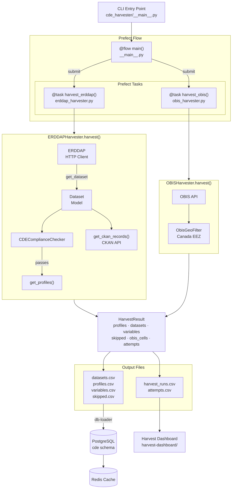
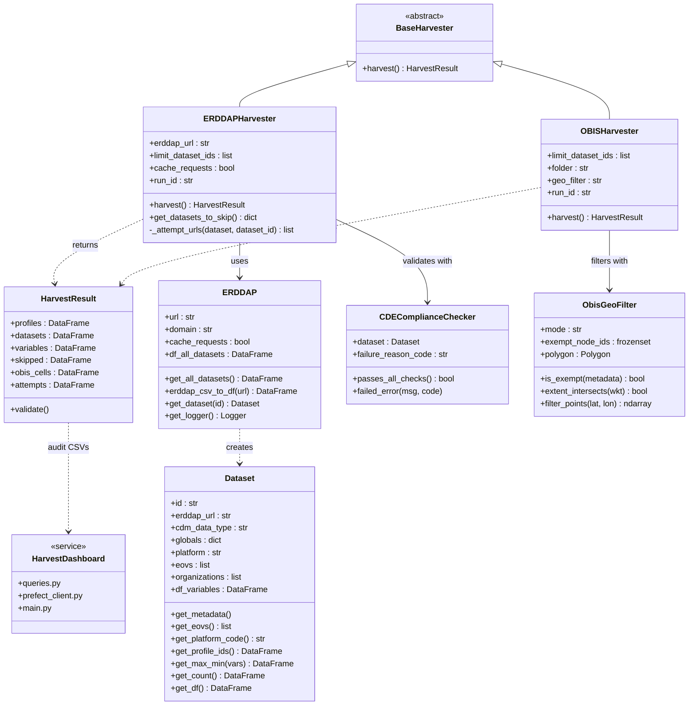

# CDE Harvester — Architecture UML

---

## Execution Flow

---

## Class Diagram

---

## Key Components

| Class | File | Responsibility |
|-------|------|----------------|
| `BaseHarvester` | `base_harvester.py` | Abstract base + `HarvestResult` dataclass |
| `ERDDAPHarvester` | `erddap_harvester.py` | Per-server ERDDAP harvest (Prefect `@task`) |
| `OBISHarvester` | `obis_harvester.py` | OBIS occurrence harvest (Prefect `@task`) |
| `HarvestResult` | `base_harvester.py` | Typed output container for all harvesters |
| `ERDDAP` | `ERDDAP.py` | HTTP client for ERDDAP REST API |
| `Dataset` | `dataset.py` | Parses metadata, variables, and profile IDs |
| `CDEComplianceChecker` | `CDEComplianceChecker.py` | CF-role, EOV, and depth/altitude validation |
| `ObisGeoFilter` | `obis_geo_filter.py` | Canada EEZ geographic filter for OBIS data |
| `get_ckan_records` | `ckan/create_ckan_erddap_link.py` | Fetches bilingual metadata from CKAN |
| `redisFunctions` | `redisFunctions.py` | Refreshes Redis tile/legend cache |

---

## Main Flow Summary

1. CLI or Prefect triggers `main()` flow in `__main__.py`
2. `harvest_erddap` tasks are submitted concurrently — one per ERDDAP server URL
3. Each `ERDDAPHarvester.harvest()` call:
   - Fetches all dataset IDs from the server (`allDatasets.csv`)
   - Filters by supported CDM data types (TimeSeries, Profile, TimeSeriesProfile)
   - For each dataset: validates compliance, extracts profiles and variables
   - Records every attempt (success / skipped / error) for the audit trail
4. `harvest_obis` task runs concurrently, filtered to Canadian waters via `ObisGeoFilter`
5. All results are merged into `HarvestResult` DataFrames
6. CKAN is queried for bilingual title/organization metadata
7. CSV files are written (`datasets`, `profiles`, `variables`, `skipped`)
8. `db-loader` loads CSVs into PostgreSQL (`cde` schema)
9. Redis cache is refreshed for the web API tile/legend queries
10. Harvest audit CSVs feed the `harvest-dashboard` service
