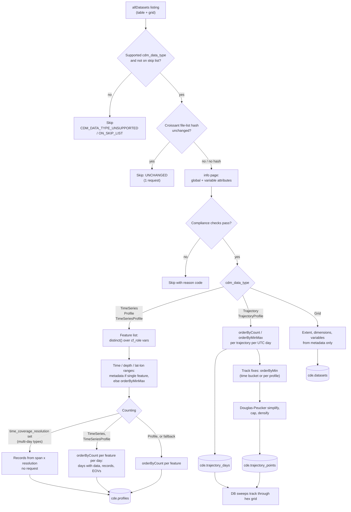

# ERDDAP harvest strategy

How the CIOOS Data Explorer harvester reads each ERDDAP `cdm_data_type`. The
goal for every dataset is to answer **what** (variables and EOVs), **when**
(time coverage and the days with data) and **where** (positions and depth)
from cheap metadata and server-side aggregations, without downloading full
record data and without overloading the source server.

Supported types: `TimeSeries`, `Profile`, `TimeSeriesProfile`, `Trajectory`,
`TrajectoryProfile` (tabledap) and `Grid` (griddap). Any other
`cdm_data_type` (e.g. `Point`, `Other`) is skipped with
`CDM_DATA_TYPE_UNSUPPORTED`.

## Every dataset

1. **Listing.** One `allDatasets` request per data structure (`table`,
   `grid`) per server, restricted to public datasets. Its `minTime`/`maxTime`
   are kept as a fallback time coverage.
2. **Pre-filters, no request issued.** Unsupported `cdm_data_type`, and
   datasets on the `skipped_datasets.json` skip list.
3. **Change detection.** The dataset's Croissant document
   (`/{tabledap|griddap}/{id}.croissant`, ERDDAP 2.28+; older servers are not
   asked) is hashed when it lists source files. On an incremental run an
   unchanged hash ends the dataset here: one request, status `UNCHANGED`.
   Database-backed datasets (no file list) are always re-harvested; federated
   datasets are followed to their origin server (up to 3 hops).
4. **Metadata.** The dataset `info` page: global attributes and per-variable
   attributes (`standard_name`, `cf_role`, `actual_range`, units).
5. **Compliance checks** (a failure is a skip, not an error):
   - `cde_ingest=false` global opts the dataset out;
   - `time`, `latitude`, `longitude` are required (`Grid`: lat/lon only);
   - at least one `standard_name` must map to a GOOS EOV;
   - not both `depth` and `altitude`.
6. **Feature extraction** by the type's handler (below). No rows means
   `NO_PROFILES_FOUND`.

Datasets are harvested **one at a time per server**; servers run in parallel.
Responses are streamed and abandoned past 200 MB (`RESPONSE_TOO_LARGE`).
Transient statuses (408, 413, 500, 502, 503, 520, 522, 524) are retried with
backoff. A 504 is not retried immediately: ERDDAP keeps computing the query
after the gateway gives up, so the dataset is retried at the end of the
server's pass, at least 20 minutes later, to pick up the cached result.

## Point-like tabledap types: `TimeSeries`, `Profile`, `TimeSeriesProfile`

One row per **feature** (a station, a cast, or a station's profile series)
in `cde.profiles`, identified by the dataset's `cf_role` variables
(`timeseries_id`, `profile_id`).

| Step | How | Requests |
| --- | --- | --- |
| Feature list | `distinct()` over the `cf_role` variables. When they are all `subsetVariables`, ERDDAP answers from its subset table and per-feature lat/lon come along. If the `distinct()` is empty (a never-filled `cf_role` column), `orderByMinMax` with `time` instead. | 1 |
| Time / depth range | Single-feature dataset: `actual_range`, else `time_coverage_start`/`end` (missing end = ongoing). Otherwise `orderByMinMax("<cf_role vars>,time")`, and the same for `depth`/`altitude`. | 0–2 |
| Position | Single-feature dataset: `actual_range` or `geospatial_*` globals. Subset-table positions when available. Otherwise `orderByMinMax` on latitude and on longitude. | 0–2 |
| Record count, days with data, EOVs | See *Counting* below. | 0–1 |

**Position.** Each feature keeps its lat/lon bounding box for spatial search.
Its map point is the exact position, or the box midpoint when the box
diagonal is at most 1 km. Larger boxes stay searchable and count in the hex
layer but are not drawn as individual dots (reported as a warning on the
harvest dashboard). Antimeridian-crossing boxes are measured the short way.

**Counting** — the costliest scan, so the cheapest available answer wins:

1. *`time_coverage_resolution` set* (multi-day types only): records =
   timesteps over each feature's span × rows per timestep. No count request.
   For `TimeSeriesProfile`, rows per timestep is sampled with one request at
   the earliest timestep. Days with data fall back to the span; every feature
   gets the dataset's EOVs.
2. *Multi-day types* (`TimeSeries`, `TimeSeriesProfile`): one
   `orderByCount("<cf_role vars>,time/86400")` returns, per feature and UTC
   day, the record count and the non-null count of each EOV-mapped variable.
   This gives the exact set of days with data, the record count, and which
   EOVs each feature actually holds. Skipped (span fallback) when
   features × span-days exceeds 20 M rows or the server refuses the
   interval grouping.
3. *Otherwise* (`Profile`, or when 2 failed): a plain per-feature
   `orderByCount("<cf_role vars>")`. A single-feature dataset spanning 30+
   days counts its first 30 days and extrapolates.

A failed count never drops the dataset; when the day set is unknown the
database derives `days` from the time span (an over-count).

**Type differences**

- `Profile` — one feature per cast; a cast is a single day, so its span is its
  day set and step 2 is never run.
- `TimeSeries` — one feature per station, spanning many days.
- `TimeSeriesProfile` — a `profile_id` that *is* `time` is dropped before the
  feature list (one "profile" per timestamp would scan the whole dataset).
  Stations are collapsed to one feature per `timeseries_id` with an
  `n_profiles` count.

## Moving platforms: `Trajectory`, `TrajectoryProfile`

Gliders, drifters, ships underway. Position changes every record, so there is
no per-feature point. Two outputs, both reduced on the ERDDAP server so the
response scales with trajectory-days, not with the full-resolution track:

- **Per-day stats** (`cde.trajectory_days`): one row per (trajectory, UTC
  day) with the record count (`orderByCount("<trajectory_id>,time/86400")`)
  and depth range (`orderByMinMax(...,depth)`; skipped when `depth`'s
  `actual_range` is constant). `TrajectoryProfile` also counts distinct
  profiles per day.
- **Track points** (`cde.trajectory_points`): ordered, downsampled fixes.
  - `Trajectory`: one `orderByMin("<trajectory_id>,time/<interval>,time")`,
    the interval sized from the active trajectory-day count so the response
    stays near 300 k candidate fixes (10 min to 1 day). Retried at a 1-day
    interval if the fine query fails.
  - `TrajectoryProfile`: one fix per profile (its first sample) via
    `orderByMin("<trajectory_id>,<profile_id>,time")`, reused for the
    per-day profile count.
  - Each trajectory is then simplified locally (Douglas-Peucker, 0.5 km
    tolerance), capped at 50 fixes per active day (1 000–60 000), and
    densified so no retained segment exceeds 25 km. A longer gap is then
    reliably a data outage and the map breaks the line there.

The database sweeps the track segments through the hex grid to build the map
coverage and apportions the per-day stats across the hexes each day's track
crossed. A dataset without a `cf_role=trajectory_id` is treated as one
trajectory.

**Fallback** for servers without `orderBy` interval grouping: only the
id/lat/lon/time(/depth) columns are downloaded in monthly chunks (each bounded
by the 200 MB cap; a failed chunk is skipped) and reduced locally. A failed
track extraction never fails a dataset whose per-day stats succeeded.

## `Grid` (griddap)

Metadata only — no data request and no per-feature rows. From the `info`
page:

- **Where:** lat/lon from `actual_range` or `geospatial_*` globals.
  0–360° longitudes are wrapped to −180–180; a min > max result marks an
  antimeridian crossing. Depth from `geospatial_vertical_*`, else the
  depth/altitude dimension.
- **When:** the `time` dimension's range, else `time_coverage_start`/`end`.
  Static grids without a time axis are accepted.
- **What:** each dimension (size, range, spacing, units) and each data
  variable (with its EOVs), stored on `cde.datasets` and used for the WMS
  overlay.

A grid with no usable lat/lon extent is skipped as `NO_PROFILES_FOUND`.
