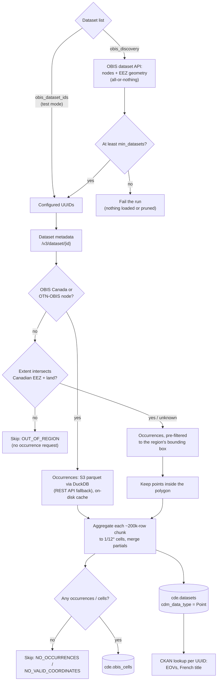

# OBIS harvest strategy

> **Harvest docs:** [Workflow](workflow.md) (`GET /harvest/docs/workflow`)
> · [ERDDAP](erddap.md) (`GET /harvest/docs/erddap`)
> · **OBIS** (`GET /harvest/docs/obis`)

This page describes how the CIOOS Data Explorer harvester reads datasets from
the [Ocean Biodiversity Information System](https://obis.org). The
[workflow](workflow.md) page shows where this fits: OBIS is one
*Harvest Source* run, enriched by CKAN and loaded with the other sources.

OBIS publishes biological **occurrences**: a species observed at a place and
time. A dataset can hold millions of them, so the harvester never stores
occurrences. It answers **what** (species), **when** (days with records) and
**where** (positions, depth) per **cell**: a 1/12° grid square, about 5
nautical miles across. Unlike ERDDAP, OBIS has no server-side aggregation, so
the occurrences are streamed and aggregated locally, in chunks of bounded
size.

## Choosing datasets

The list of datasets is built when the run starts. The first configured
option wins:

1. **`obis_dataset_ids`**: harvest exactly these UUIDs. This is test mode, and
   discovery is not run.
2. **`obis_discovery`** (production): ask the OBIS dataset API
   (`/v3/dataset`) and take the union of:
   - every dataset contributed through the **OBIS Canada** and **OTN-OBIS**
     nodes (`nodes`);
   - every dataset with at least one occurrence inside the **Canadian EEZ and
     land boundary** (`geometry: eez`). OBIS applies this filter to individual
     occurrences, so it is exact rather than a bounding-box match;
   - optional `areas` and `include` lists, minus any `exclude` list (for
     example, a global 11.5 M-occurrence dataset that does not fit in the
     worker's memory).
3. **`obis_datasets_file`**: the legacy static list, kept as a rollback.

Discovery is **all-or-nothing**. A failed query, a query that returns no
datasets, a truncated response, or a total below `min_datasets` (700 in
production) fails the OBIS run before anything is loaded. A short list must
never reach the database, because the loader would then delete every dataset
missing from it as gone upstream (see
[Loading](workflow.md#loading)).

Two OBIS API limits shape the queries:

- `/v3/dataset` ignores the paging offset, so each query asks for everything
  at once (`size` ≥ total). A response shorter than its `total` is retried
  once with a larger size, then refused.
- A geometry over about 6 KB in the query string is rejected. The packaged
  boundary polygon (~11 KB) is therefore simplified, then buffered outward so
  it always **contains** the original. The query can over-select, never miss
  a coastal dataset. The exact polygon is applied later, to each occurrence.

## Every dataset

Datasets are harvested one at a time, up to 5 attempts each.

| Step | How | Requests | Skip / error |
| --- | --- | --- | --- |
| Metadata | `api.obis.org/v3/dataset/{id}`: title, institutes, nodes, extent | 0–1 (cached) | — |
| Region check | Datasets from the exempt nodes (OBIS Canada, OTN-OBIS) are kept whole. Any other dataset whose extent misses the region is skipped before any occurrence is fetched. A missing or unreadable extent falls through to the occurrence filter. | 0 | `OUT_OF_REGION` |
| Occurrences | DuckDB reads the dataset's parquet from the OBIS open-data bucket on S3: only the 7 columns needed, and only rows inside the region's bounding box. If that fails before any row arrives, the REST API is paged instead (10 000 rows per page). | 1 (cached) | `NO_OCCURRENCES` |
| Cells | Each ~200 k-row chunk is aggregated to cells (below), then the per-chunk results are merged | 0 | `NO_VALID_COORDINATES` |
| CKAN | One lookup per UUID, after all datasets are harvested (see [CKAN](workflow.md#ckan)) | 0–1 (cached) | never fails the dataset |

A dataset that still fails after 5 attempts is recorded as `UNKNOWN_ERROR`.
Its on-disk cache is cleared between attempts, so a corrupt cached file
cannot fail every retry.

## Occurrence cells

Within each chunk:

1. Drop occurrences without coordinates, or outside the Web Mercator range
   (|lat| > 85.06°).
2. Unless the dataset is exempt, keep only points inside the boundary
   polygon.
3. Snap each position to the 1/12° grid.
4. Group by cell. Each `cde.obis_cells` row gets:

| Column | Meaning |
| --- | --- |
| `latitude`, `longitude` | Cell centre |
| `n_records` | Occurrences in the cell |
| `time_min`, `time_max` | Earliest start / latest end date |
| `day_ranges`, `days` | Distinct UTC days with records, from the occurrence's start date. A coarse date such as "1997" counts as one day, not a whole year. |
| `depth_min`, `depth_max` | From `minimumDepthInMeters` / `maximumDepthInMeters`; 0 when unknown |
| `scientific_names` | Sorted distinct taxa, later matched to WoRMS AphiaIDs |

Every aggregation is associative, so merging chunk results gives exactly the
same cells as one pass over the whole dataset. The day count is the only
exception: it is recomputed from the merged day ranges rather than added up.
Peak memory therefore depends on the chunk size, not on the dataset size.
Finished cells are written to disk every 50 datasets, so a full run (~1 000
datasets) fits in the worker.

## Dataset row

Each OBIS dataset becomes one `cde.datasets` row with `source_type = obis`,
`cdm_data_type = Point`, and the server key `https://obis.org`:

- **Title**: from CKAN when the dataset has a CKAN record, else OBIS's title,
  else the UUID.
- **Organizations**: the OBIS institutes.
- **OBIS nodes**: the contributing nodes (used by the nodes filter).
- **EOVs**: from the CKAN record. A dataset without a CKAN record has none.
- **Features**: the number of cells (`n_profiles`).

## Freshness and caching

OBIS has no change signal like ERDDAP's Croissant hash. Every OBIS run
re-harvests and reloads the whole dataset list, which is also how added and
withdrawn datasets are picked up.

Metadata, occurrences and CKAN lookups are cached as gzip JSON in the
`obis_cache` volume, shared across runs. **The cache has no expiry.** A
dataset's occurrences are downloaded once, and later runs rebuild its cells
from the cached copy. New records published upstream for an
already-harvested dataset are therefore not picked up until its cache files
are deleted. The cache is cleared automatically only between failed attempts.

## In the database

The loader replaces the OBIS cells, then:

- adds each new cell position to `cde.points` and links the cell to it;
- builds the map hexes, so cells count in the map layer;
- updates each dataset's cell count;
- refreshes `cde.obis_scientific_names`, which drives the taxon search;
- fills each cell's AphiaIDs from `cde.scientific_name_vernaculars`.

In an incremental load these steps run only when OBIS data changed; otherwise
only the AphiaID backfill runs. The separate **Populate Vernaculars**
deployment looks up WoRMS common names for new taxa, which the next load
attaches to the cells.

## Reason codes

| Code | Status | Meaning |
| --- | --- | --- |
| `OUT_OF_REGION` | skipped | The extent misses the Canadian EEZ and land, and the dataset is not from an exempt node |
| `NO_OCCURRENCES` | skipped | OBIS returned no occurrences |
| `NO_VALID_COORDINATES` | skipped | No occurrence survived the coordinate and region filters |
| `UNKNOWN_ERROR` | error | All 5 attempts failed; the message holds the last error |

As with ERDDAP, a dataset that errors or is skipped keeps the rows loaded by
an earlier run. Removing a dataset therefore takes one of two things: it drops
out of the dataset list (pruned as gone upstream), or it is skipped as
`NO_PROFILES_FOUND`, which OBIS never reports.
